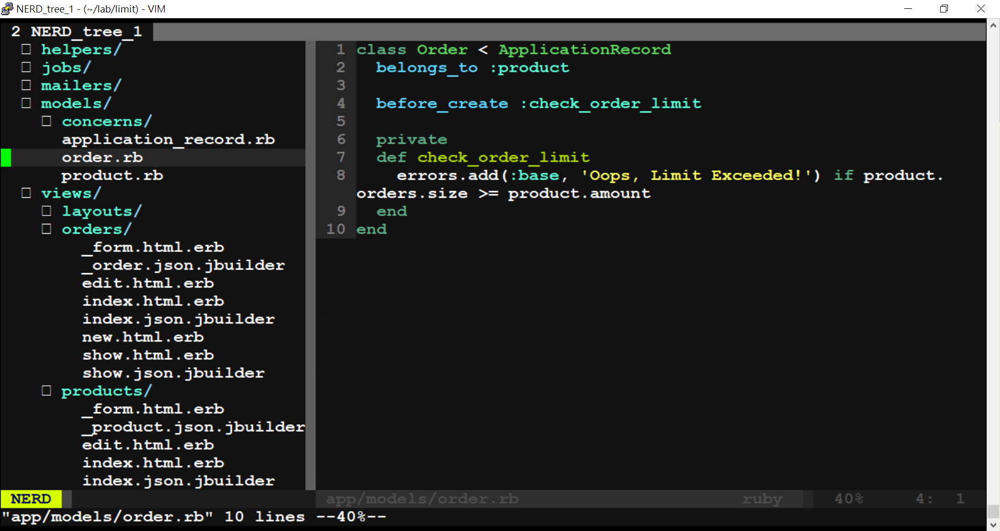
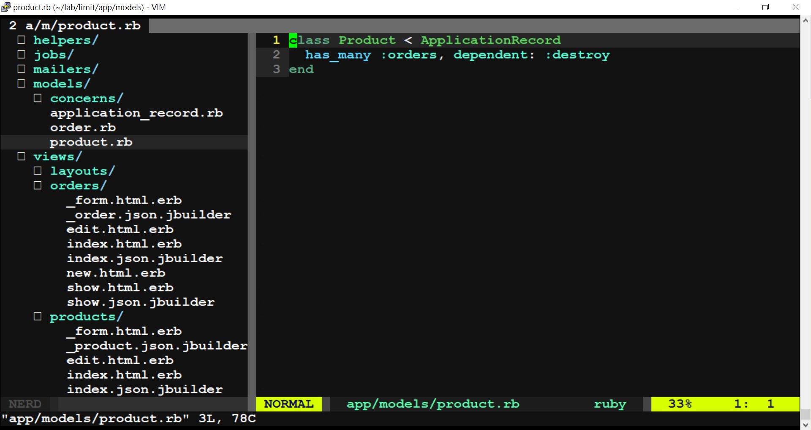
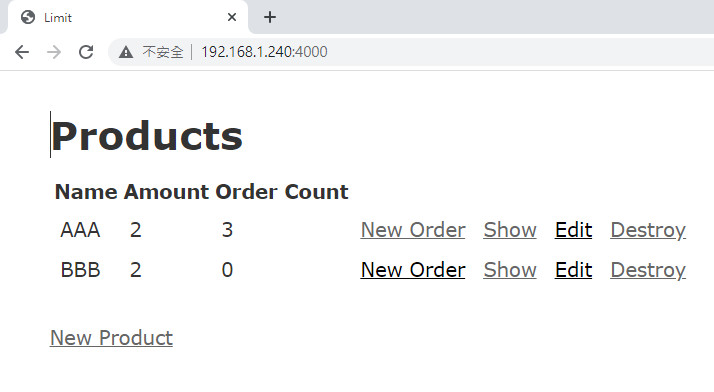
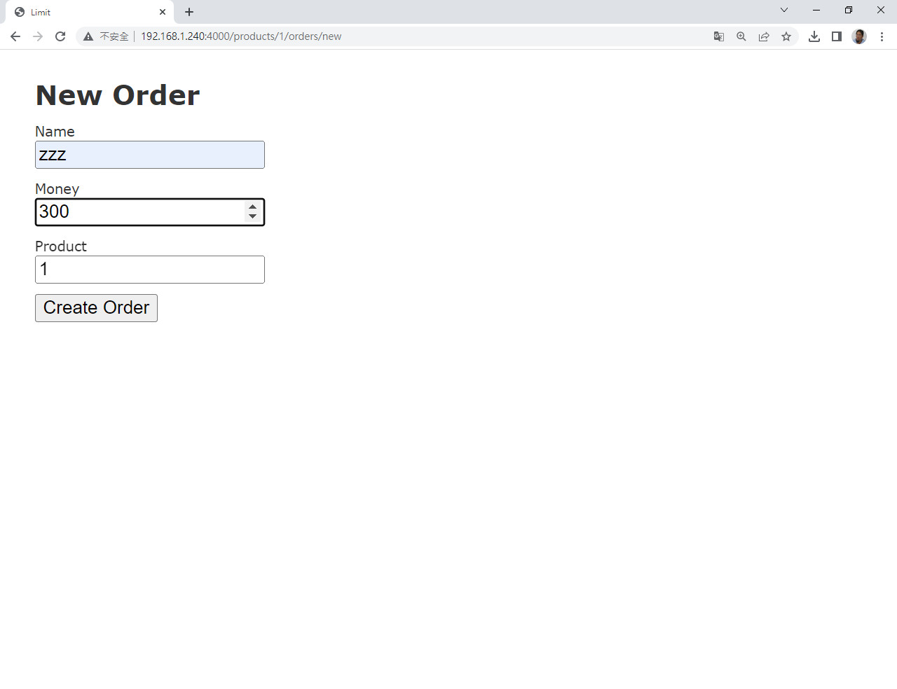
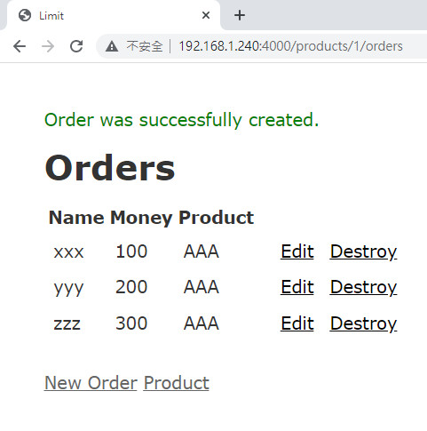

# How to limit nested model total counts?

## Question description:

> as title, I have product & order model with nested relationship, like:
```
resources :products do
  resources :orders 
end
```
> Products has a filed, it name is 'amount', for example is 5.
> how can I limit orders total counts less than or equal to 5?
> I don't know how to use parent keyword in order model. Who can help me? thanks.
> I need a resolution, thanks.











## Answer from Abhishek Badmaliya

> We can act in this way. Here, I'll give you an answer in the form of a piece of code. You can test the code below, where I've created a method to handle this limit.

```
class Order < ApplicationRecord
  # association
  belongs_to :product
  # create callback
  before_create :check_order_limit

  private

  # created method which is called before creation
  def check_order_limit
    errors.add(:base, 'Oops, Limit Exceeded!') if product.orders.size >= product.amount
  end
end
```

But it's not work! I can't see any error message when I overload in amount!


[https://stackoverflow.com/questions/76069450/how-to-limit-nested-model-total-counts](https://stackoverflow.com/questions/76069450/how-to-limit-nested-model-total-counts)

